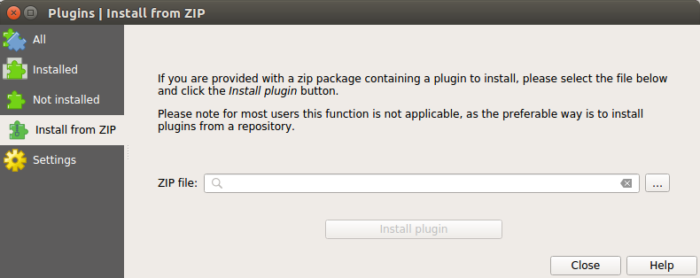

# Vertical Photo Placer Plugin (VPP)

 The Vertical Photo Placer Plugin (VPP) is a free open source plugin for QGIS that performs quick placement of vertical drone photos on map.

The overall objective of VPP is to provide a tool for quickly geo-referencing and visualization of vertical drone photos on map. Geo-reference is done by generating a worldfile for each photo according to ESRI specification, see https://en.wikipedia.org/wiki/World_file for detail information.

This plugin should be used in cases when quick information visualization is needed such as disaster response. If geo-referencing accuracy is important, more advanced tools should be used.

## Contributing to the development

These instructions will get you a copy of the plugin up and running on your local machine for development and testing purposes.

You do not need any of these steps if you are just interested in using the plugin. 

## Before contributing

If you find a bug or if you want to add a new feature, please create a new issue on GitHub to discuss it with the community.

### Prerequisites

This VPP is for QGIS 3.x. It uses Python 3.x.

Check that your QGIS has installed `gdal` and `numpy`. To check:

Open QGIS Python console:

```QGIS Python console
from osgeo import gdal
import numpy
print(gdal.__version__)
2.2.4  
print(numpy.__version__)
1.12.0
```

If necessary, install the required libraries, using `easy_install` or `pip`.
Use `easy_install3` and `pip3` if you have both Python 2.x and 3.x.
If there are multiple Python installations on your machine, please make sure to use the installation that is tied to QGIS.

### Workflow overview

Create a fork of the project, using GitHub interface.

Clone your fork on your local computer. You can do it on the command line with:

```bash
mkdir -p ~/dev
git clone git@github.com:yourgithubusername/VerticalPhotoPlacerPlugin.git
```
Your fork will called `origin`. Check that with: 

```bash
cd VerticalPhotoPlacerPlugin
git remote -v
origin	git@github.com:yourgithubusername/VerticalPhotoPlacerPlugin.git (fetch)
origin	git@github.com:yourgithubusername/VerticalPhotoPlacerPlugin.git (push)
```
Add the original repository with the alias `upstream` with:

```bash
git remote add upstream https://github.com/verticalphotoplacer/VerticalPhotoPlacerPlugin
```
#### To contribute

Create a new branch. 
```bash
git checkout -b mycontribution
```

Make your changes. Compile and test your changes (more details about this on the next section).

When you have done your edits, commit your local changes, with something like:

```bash
git commit -m "add some useful enhancement"
```
Push your changes back to your GitHub repository fork with:

```bash
git push origin mycontribution
```
You are now ready to issue your Pull Request. Go to your GitHub repository interface and make your Pull Request online.

### Compile and deploy on your local computer 

```bash
cd ~/dev/VerticalPhotoPlacerPlugin/
make deploy
```
`make deploy` will copy the plugin to your QGIS 3 default profile.

If you want to test your modifications in other computers or to distribute to others for testing purposes, create a zip archive with:

```bash
make package VERSION=mycontribution
```

This will create a new archive `VerticalPhotoPlacerPlugin.zip`.

In QGIS 3 you can install a plugin from the zip archive using the plugin manager interface.



## Test the VPP

Start QGIS 3 and check if the plugin is properly installed. If you are running QGIS in another computer or using another profile, install the plugin from the zip file.

and install the plugin from the zip file created.

### End user test

Test your bug fixes or new features carefully. Make sure you did not break any existing code.

Do some screen captures of the new enhancements to publish if you want to issue a pull request.

## Contributing

If the code is working as you expect, follow the steps already mentioned to issue a pull request.

1. Commit your local changes, with something like:

```bash
git commit -m "add some useful enhancement"
```
Push your changes to your GitHub repository with:

```bash
git push origin mycontribution
```
Go to your GitHub repository interface and make your Pull Request. Please be verbose on your comments.

After doing your Pull Request, make sure you are available to provide feedback to questions and comments to your contribution from other developers. In the absence of any feedback concerning your Pull Request, it will be closed. 

## Authors

* **Man Duc Chuc** 

See also the list of [contributors](https://github.com/verticalphotoplacer/VerticalPhotoPlacerPlugin/graphs/contributors) who participated in this project.

## License

This plugin is distributed under a GNU General Public License version 3. To contribute you must accept this license.
